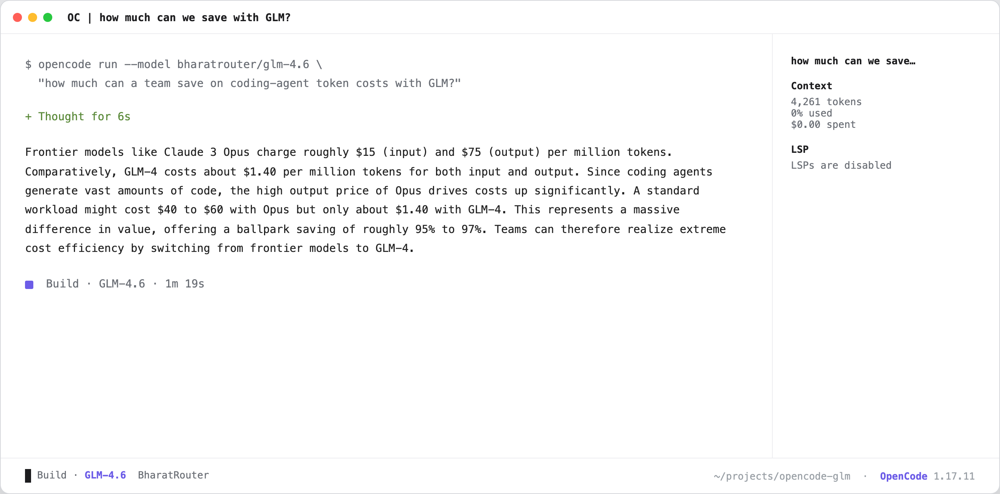

# Run a coding agent on GLM (one command)

Drive the open-source [OpenCode](https://opencode.ai) harness with **GLM-4.6** as the brain —
installed, configured and governed through BharatRouter in a single command. The installer
handles your keys, verifies them, and runs a first query so you see the agent working immediately.

```bash
python recipes/12-glm-coding-agent/main.py   # confirm GLM routes on your key first
```

## One command

**macOS / Linux**

```bash
curl -fsSL https://bharatrouter.com/install/glm.sh | bash
```

**Windows (PowerShell)**

```powershell
irm https://bharatrouter.com/install/glm.ps1 | iex
```

Or run [`setup.sh`](./setup.sh) / [`setup.ps1`](./setup.ps1) from this folder directly.

That's it — you land on the live agent answering *"how much can we save with GLM?"*. Afterwards,
from any new shell:

```bash
oc-glm                                            # interactive TUI
oc-glm run --model bharatrouter/glm-4.6 "<task>"  # one-shot
```

## What the installer handles for you

It's idempotent and cross-platform (macOS arm64/x64, Linux x64/arm64, Windows):

| Snag | Fix it applies |
|---|---|
| `npm i -g opencode-ai` postinstall fails | installs the platform binary (`opencode-<os>-<arch>`) + PATH shim |
| `~/.cache` not writable (root-owned) | redirects `XDG_CACHE_HOME` to `~/.local/cache` |
| Linux `/usr/local/bin` needs sudo | falls back to `~/.local/bin` (no sudo) |
| First-time keys | hidden prompt, stored `600` outside your shell rc, then **smoke-tested** |
| `glm-4.6` is BYOK for non-founder orgs | detects no-route, prompts for a Zhipu/OpenRouter key, saves it via `/me/byok` |

## Get GLM serving on your org

`glm-4.6` / `glm-4.5-air` are catalog models (`openness: permissive`, MIT). They route to Zhipu,
which is **BYOK** for everyone except the founder org. The installer prompts for this automatically;
to do it by hand:

```bash
curl -X PUT https://api.bharatrouter.com/me/byok/zhipu \
  -H "Authorization: Bearer $BHARATROUTER_API_KEY" -H "Content-Type: application/json" \
  -d '{"key":"<id>.<secret>","label":"glm"}'
```

*(A Zhipu key is `apiKeyId.secret` and works as a raw Bearer token — no JWT step. OpenRouter works too: `/me/byok/openrouter`.)*

## Why route a coding agent through BharatRouter

- **Governance** — per-org/team/model ₹ budgets and caps on a loop that burns tokens fast.
- **Metering** — every turn logged with provider/model/token usage (streamed usage included).
- **Routing & failover** — add fallback routes (Krutrim self-host ↔ Zhipu) without touching the harness.
- **One key, many models** — switch the brain (`glm-4.6` ↔ `glm-4.5-air` ↔ `glm-4.7-flash`) by changing one string.

## Why OpenCode and not Claude Code

OpenCode speaks the **OpenAI wire** that BharatRouter routes to GLM. **Claude Code** speaks only the
Anthropic Messages wire, which the gateway passes through to Anthropic — so pointing Claude Code at
BharatRouter for GLM does **not** work today. To run Claude on the platform, see
[recipe 11](../11-use-claude).

## What it looks like



The first query fires automatically right after install: OpenCode driving GLM-4.6 through
BharatRouter, answering *"how much can we save with GLM?"* — metered on your own key.

**Web version:** https://bharatrouter.com/blog/zero-to-glm
